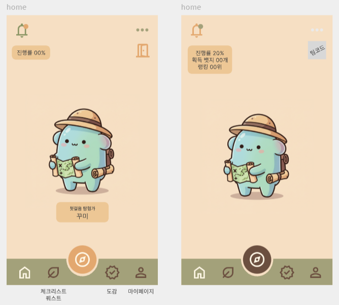
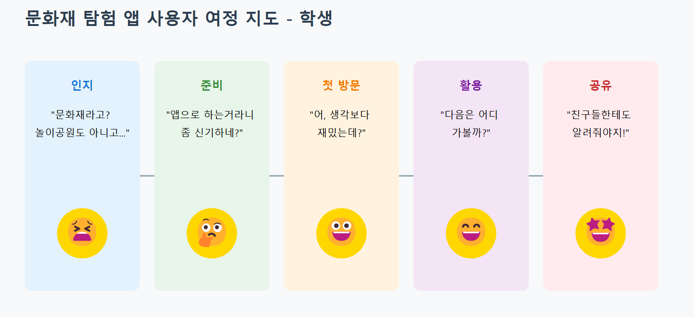
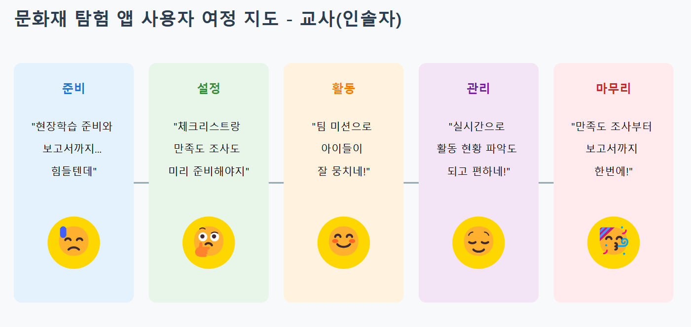

# 문방구 (문화재 탐방 친구)
> <b>"초등학생과 인솔자를 위한 교육용 문화재 탐방 어플"</b>  

  

## 1. 소개

현장학습에서 `학생`들은 <b>사진 인증의 번거로움, 단순 관람과 불분명한 학습 목적으로 인한 <u>지루함을 호소</u></b>하고 있으며, `인솔자`들은 <b><u>실시간 활동 현황 파악의 어려움과 체계적인 관리 도구의 부재</u></b>로 고민하고 있습니다. 이러한 문제를 해결하고자 GPS 위치 서비스와 게임적 요소를 접목한 새로운 교육용 앱을 기획하게 되었습니다. 학생들은 퀴즈와 미션을 해결하며 문화재를 즐겁게 배울 수 있고, 인솔자들은 실시간 모니터링과 체계적인 관리 도구를 활용할 수 있어 보다 효율적인 현장학습이 가능해질 것으로 기대됩니다.

### 1) 페르소나
> <b>인솔자</b>  

| <b>속성</b> | <b>정보</b> |
| --- | --- |
| <b>이름</b> | 김지현 |
| <b>나이</b> | 32세 |
| <b>현재 상황</b> | [은주 누나가 작성하면 좋을 것 같아요!] |
| <b>목표 및 니즈</b> | [은주 누나가 작성하면 좋을 것 같아요!] |  

| 고민사항 | 내용 |
| --- | --- |
| <b>학생 관리</b> | 현장 체험 학습 중 학생들이 자유시간에 제대로 관람하고 있는지 확인하기 어려움  현장에서 학생들의 활동 진행 정도를 파악할 수 있는 시스템이 부족함 |
| <b>흥미 유발</b> | 문화재에 대한 학생들의 부정적 인식과 낮은 관심도  "지루하다", "재미없다" 등 불만 표현 증가 |
| <b>학습 효과</b> | 단순 관람을 넘어선 교육적 효과 달성 어려움  현장학습 후 학습 내용 정리 및 평가 방법 고민 |
| <b>안전 관리</b> | 많은 인원의 동시 이동에 따른 안전사고 우려  문화재 훼손 방지와 적극적 관람 사이 균형 유지에 관한 고민  문화재 관람시의 안전수칙과 질서유지 교육의 집중도가 낮음 |
| <b>시간 관리</b> | 관람 동선과 시간 배분의 효율적 계획 수립  식사 및 휴식 시간 배분 문제 |
| <b>소통 관리</b> | 단체 공지사항 전달의 어려움  우천 등 예상치 못한 상황으로 인한 일정 변동 시 공지의 어려움 |
| <b>설문 조사</b> | 현장학습 참여도 평가 기준 설정의 고민  학생들의 낮은 설문 참여율 |
| <b>관람 여부</b> &nbsp;&nbsp;| 현장학습 효과 측정 방법 부재  현장에서 카카오톡을 통해 사진 전송으로 관람 여부를 확인하지만, 사진 속 인원이 누구인지 다시 확인해야 하는 번거로움이 존재 |

 

> <b>학생</b>  

| 속성 | 정보 |
| --- | --- |
| <b>이름</b> | 송민준 |
| <b>나이</b> | 12세 |
| <b>현재 상황</b> | 문화재 탐방을 갔지만, 재미가 없어 그냥 친구들과 놀고 싶음 |
| <b>목표 및 니즈</b> | 현장체험학습의 지루한 과정을 친구들과 즐기며 참여할 수 있는 콘텐츠면 좋겠음 |  

| 고민사항 | 내용 |
| --- | --- |
| <b>시간 부담</b> | 문화재 현장학습으로 인한 자유시간/휴식시간 부족 |
| <b>지루함</b> | 단순히 문화재를 보고 설명 듣는 것이 지루하고 재미없음 |
| <b>학습 부담</b> | 현장학습 후 보고서나 감상문 작성에 대한 부담  문화재 설명을 메모하고 기억해야 한다는 스트레스 |
| <b>팀워크 문제</b> | 관람 계획에 대한 팀원과의 갈등 |
| <b>사진 인증</b> | 문화재마다 사진 찍어 인증해야 하는 번거로움  인증용 사진 촬영으로 인한 진정한 관람 시간 부족 |
| <b>목적의식 부재</b> | 그냥 보고 지나가는 것 외에 무엇을 해야 할지 모르겠음  문화재를 보면서 무엇을 배워야 하는지 불분명함 |
| <b>동기 부여 부족</b> &nbsp;&nbsp; | 단순히 시간을 때우는 식으로 관람하게 됨 |

### 2) 고객 여정 지도
  

  

 

## 2. 기능 소개
### 1) 학생용 기능

학생 기능 소개

### 2) 인솔자용 기능

인솔자 기능 소개

### 3) 요구사항 명세서

## 3. 기대효과
### 3-1. 학생
#### 가. 교육적 효과 증대
- **학습의 흥미 유발**  
  게이미피케이션을 활용해 학생들이 재미있게 학습하며 문화재에 대한 관심을 자연스럽게 유도.
- **현장 체험 학습의 효율성 강화**  
  위치 기반 퀴즈 및 도감을 통해 방문한 문화재와 관련된 정보를 깊이 학습할 수 있는 기회 제공.
- **교과 내용과의 연계성 강화**  
  문제와 도감 콘텐츠를 교과 과정에 맞춰 설계하여 학업 성취도를 높임.
- **지속 가능한 학습 환경 조성**  
  학습 후에도 도감 및 리워드 시스템을 통해 지속적인 학습 동기 부여.

#### 나. 참여도와 협력 능력 향상
- **팀 기반 활동**  
  팀 랭킹 시스템, 릴레이 퀴즈 등을 통해 학생들 간 협력 및 소통을 장려.
- **협력과 참여의 증진 (소외 학생 고려)**  
  팀 기반 활동과 협력을 유도하여 소외되는 학생 없이 모두가 참여할 수 있는 환경 조성.  
  개인 맞춤형 난이도 조정과 힌트 기능을 통해 학습 능력에 차이가 있는 학생들도 자신감을 갖고 활동에 참여 가능.

#### 다. 문화재 관심 및 보존 인식 제고
- **문화재 탐방 촉진**  
  다양한 루트와 미션을 통해 학생들이 문화재에 대한 흥미를 느끼고 직접 방문하도록 유도.
- **문화재의 역사적 가치 재발견**  
  스토리라인 연결 및 도감 학습을 통해 학생들이 문화재의 역사적, 문화적 의미를 이해.

### 3-2. 교사(인솔자)
#### 가. 관리 효율성 증대
- **학생 안전 관리 강화**  
  실시간 학생별 진행도 파악을 통해 학생 동선을 철저히 관리하여 안전 관리를 강화할 수 있음.

#### 나. 현장학습 준비 부담 완화
- **편리한 현장 학습 관리**  
  코스 설정, 문제 난이도 조정, 반 내 팀 관리 등으로 활동을 사전에 효율적으로 계획하고 운영 가능.
- **보고서 자동화 지원**  
  현장학습 후 보고서를 자동 생성하여 사후 업무 부담 감소.

#### 다. 수업 효과 증대와 만족도 상승
- **학습의 의미 부여**  
  탐방 후 도감 완성과 리워드 제공으로 학생들에게 학습 동기를 지속적으로 부여
- **현장학습 만족도 향상**  
  재미있고 체계적인 학습 활동을 통해 학생과 학부모의 만족도를 높이며, 교사로서의 성과도 향상
- **팀 기반 활동 관리**  
  팀별 랭킹 및 점수 체계를 통해 협력 학습의 장을 제공하며, 팀워크 증진을 지원
- **학습과 재미의 균형**  
  게임적 요소와 교육적 목표가 조화를 이루어 학생들이 즐겁게 학습하도록 유도

## 4. 프로젝트 주간 개발 일지
| 날짜 |전체 | 손은주 | 최대규 | 제갈민 | 박성민 | 이용재 | 김병년 |
| --- | --- | --- | --- | --- | --- | --- | --- |
| 25.01.13(월) | 한 일 | 한 일 | 한 일 | 한 일 | 한 일 | 한 일 | 한 일 |
| 25.01.14(화) | 한 일 | 한 일 | 한 일 | 한 일 | 한 일 | 한 일 | 한 일 |
| 25.01.15(수) | 한 일 | 한 일 | 한 일 | 한 일 | 한 일 | 한 일 | 한 일 |
| 25.01.16(목) | 한 일 | 한 일 | 한 일 | 한 일 | 한 일 | 한 일 | 한 일 |
| 25.01.17(금) &nbsp; | 한 일 | 한 일 | 한 일 | 한 일 | 한 일 | 한 일 | 한 일 |
